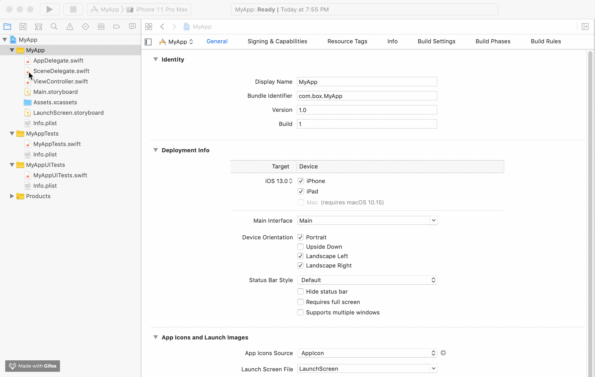

# Box Preview SDK

[](https://cocoapods.org/pods/BoxPreviewSDK)
[](https://raw.githubusercontent.com/box/box-ios-preview-sdk/main/LICENSE)

[](https://github.com/apple/swift-package-manager)
[](https://github.com/Carthage/Carthage)
[](https://cocoapods.org/pods/BoxPreviewSDK)

[](https://travis-ci.com/box/box-swift-preview-sdk)

This SDK makes it easy to present Box files in your iOS application.

> **_NOTE:_**  The Box iOS Preview SDK in **Objective-C** (prior to v3.0.0) has been moved from the main branch to the [objective-c-maintenance branch](https://github.com/box/box-ios-preview-sdk/tree/objective-c-maintenance).
Going forward, the main branch will contain the iOS Preview SDK in **Swift**, starting with v3.0.0.


## Table of Contents
<!-- START doctoc generated TOC please keep comment here to allow auto update -->
<!-- DON'T EDIT THIS SECTION, INSTEAD RE-RUN doctoc TO UPDATE -->


- [Requirements](#requirements)
- [Installing the SDK](#installing-the-sdk)
  - [Carthage](#carthage)
  - [CocoaPods](#cocoapods)
  - [Swift Package Manager](#swift-package-manager)
- [Getting Started](#getting-started)
- [Sample Apps](#sample-apps)
  - [OAuth2 Sample App](#oauth2-sample-app)
  - [CCG Auth Sample App](#ccg-auth-sample-app)
- [Open a PDF File](#open-a-pdf-file)
- [Open an Image File](#open-an-image-file)
- [Future Enhancements](#future-enhancements)
- [Versions](#versions)
  - [Supported Version](#supported-version)
  - [Version schedule](#version-schedule)
- [Copyright and License](#copyright-and-license)

<!-- END doctoc generated TOC please keep comment here to allow auto update -->

Requirements
------------------

- iOS 11.0+
- Xcode 10.0+

Installing the SDK
------------------

### Carthage

__Step 1__: Add to your `Cartfile`

```ogdl
git "https://github.com/box/box-ios-sdk.git" ~> 5.0
git "https://github.com/box/box-ios-preview-sdk.git" ~> 3.0
```

__Step 2__: Update dependencies
```shell
$ carthage update --use-xcframeworks --platform iOS
```

__Step 3__: The xcframework in the Carthage/Build folder is already referenced in the BoxPreviewSDKSampleApp Xcode project.

For more detailed instructions, please see the [official documentation for Carthage](https://github.com/Carthage/Carthage#if-youre-building-for-ios-tvos-or-watchos).

### CocoaPods

__Step 1__: Add to your `Podfile`

```
pod 'BoxPreviewSDK', '~> 3.0'
```

__Step 2__: Install pod by running the following command in the directory with the `Podfile`

```
$ pod install
```

For more detailed instructions, please see the [official documentation for Cocoapods](https://guides.cocoapods.org/using/using-cocoapods.html).

### Swift Package Manager

#### Importing BoxPreviewSDK into Project

__Step 1__: Click on Xcode project file

__Step 2__: Click on Swift Packages and click on the plus to add a package

__Step 3__: Enter the following repository url `https://github.com/box/box-ios-preview-sdk.git` and click next

__Step 4__: Leave the default settings to get the most recent release and click next to finish importing

The process should look like below:




#### Adding BoxPreviewSDK as a Dependency

For detailed instructions, please see the [official documentation for SPM](https://swift.org/package-manager/). 

Getting Started
---------------

To get started with the SDK, you'll need the Client ID and Client Secret of your app in the [Box Developer Console][dev-console].
If you're familar with [Getting Started with the OAuth2 Sample App in the Box Content SDK](https://github.com/box/box-ios-sdk/docs/usage/getting-started.md#oauth2-sample-app)
you'll find the process very similar.

[dev-console]: https://app.box.com/developers/console

Sample Apps
-----------
### OAuth2 Sample App

A sample app using OAuth2 Authentication can be found in the repository [here][oauth2-sample-app].  This app demonstrates how to use the
Box Preview SDK to make calls with OAuth2 Authentication, and can be run directly by entering your own credentials to
log in.

[oauth2-sample-app]: https://github.com/box/box-ios-preview-sdk/tree/main/SampleApps/OAuth2SampleApp

To execute the sample app:

__Step 1__: Run carthage
```shell
$ cd SampleApps/OAuth2SampleApp
$ carthage update --use-xcframeworks --platform iOS
```

__Step 2__: Open Xcode Project File
```shell
$ open OAuth2SampleApp.xcodeproj
```

__Step 3__: Insert your client ID and client secret

First, find your OAuth2 app's client ID and secret from the [Box Developer Console][dev-console].  Then, add these
values to the sample app in `Constants.swift` file:
```swift
static let clientId = "YOUR CLIENT ID GOES HERE"
static let clientSecret = "YOUR CLIENT SECRET GOES HERE"
```

__Step 4__: Set redirect URL

Using the same client ID from the previous step, set the redirect URL for your application in the [Box Developer Console][dev-console] to
`boxsdk-<<YOUR CLIENT ID>>://boxsdkoauth2redirect`, where `<<YOUR CLIENT ID>>` is replaced with your client ID.  For example, if your client
ID were `vvxff7v61xi7gqveejo8jh9d2z9xhox5` the redirect URL should be
`boxsdk-vvxff7v61xi7gqveejo8jh9d2z9xhox5://boxsdkoauth2redirect`

__Step 5__: Insert your client ID to receive the redirect in the app

Open the `Info.plist` file in the sample app and find the key here:
URL Types --> Item 0 --> URL Schemes --> Item 0
Using the same client ID from the previous step, set the value for Item 0 to
`boxsdk-<<YOUR CLIENT ID>>`, where `<<YOUR CLIENT ID>>` is replaced with your client ID.  For example, if your client
ID were `vvxff7v61xi7gqveejo8jh9d2z9xhox5` the redirect URL should be
`boxsdk-vvxff7v61xi7gqveejo8jh9d2z9xhox5`


__Step 6__: Run the sample app

The app opens with a prompt to begin OAuth2.0 Authentication. Tap "OAuth2.0 Authentication" to proceed.

On the next screen, tap "Login".

An iOS System Dialog pops up asking if you agree to open a URL to authenticate. Tap "Continue" to proceed.

A Box login page loads. Enter your credentials and tap "Authorize" to proceed.

A confirmation screen displays the name of your application, as defined in the Box Developer Console, along with the scopes it is configured with. Tap "Grant access to Box" to grant your application access to the Box account.

The next screen displays all the files in the root folder for the account. If you don't see any files on the screen, check that you have files saved in the root folder of the Box account. Note that for simplicity, folders are not displayed in this sample app. From this screen you can tap the back arrow to log out, or tap a file name in the list to download it and display it. PDF and all iOS-supported image files are currently supported in the app.

### CCG Auth Sample App

A sample app using CCG Authentication can be found in the repository [here][ccg-sample-app]. This app demonstrates how to use the
Box Preview SDK to make calls with CCG Authentication.

[ccg-sample-app]: https://github.com/box/box-ios-preview-sdk/tree/main/SampleApps/CCGSampleApp

To execute the sample app:

__Step 1__: Run carthage
```shell
$ cd SampleApps/CCGSampleApp
$ carthage update --use-xcframeworks --platform iOS
```

__Step 2__: Open Xcode Project File
```shell
$ open CCGSampleApp.xcodeproj
```

__Step 3__: Insert your client ID and client secret

First, find your CCG app's client ID and secret from the [Box Developer Console][dev-console].  Then, add these
values to the sample app in `Constants.swift` file:
```swift
static let clientId = "YOUR CLIENT ID GOES HERE"
static let clientSecret = "YOUR CLIENT SECRET GOES HERE"
```

__Step 4__: Insert your userId if you to use CCG for user connection or enterpriseId for account service connection

You can find these values in your app at [Box Developer Console][dev-console].  Then, add these
values to the sample app in `Constants.swift` file:
```swift
static let userId = "YOUR USER ID GOES HERE"
static let enterpriseId = "YOUR ENTERPRISE ID GOES HERE"
```

__Step 5__: Uncomment the appropriate section in `authorizeWithCCGClient()` method in ViewController class.

As this sample app is prepared to CCG authentication as user and account service, you should uncomment 
`Section 1` for CCG connection for account service or `Section 2` for CCG connection for user account.

__Step 6__: Run the sample app

The next screen displays all the files in the root folder for the account. If you don't see any files on the screen, check that you have files saved in the root folder of the Box account. Note that for simplicity, folders are not displayed in this sample app. From this screen you can tap the back arrow to log out, or tap a file name in the list to download it and display it. PDF and all iOS-supported image files are currently supported in the app.

Open a PDF File
---------------

Tap a PDF file in the file list.  A progress bar indicates the download progress as the file is retrieved from Box.  When the progress reaches 100%, the document is displayed.

The toolbar at the top contains an arrow to go back to the file list, the file name, the current page number, an outline view button (if the document contains an outline) and a gallery view button.  The toolbar can be toggled by tapping the document.

The outline view allows you to view the hierarchical structure of the document and offers quick navigation to a particular page.

The gallery view shows large thumbnails of each page and offers quick navigation to a particular page.

The document supports left and right swiping gestures to navigate one page at a time, pinch-to-zoom gestures and panning.

For PDF files containing multiple pages, the thumbnail navigation bar at the bottom of the screen allows for quick navigation through the entire document.


Open an Image File
------------------
Tap an image file (JPG, JPEG, PNG files are currently supported) in the file list.  A progress bar indicates the download progress as the file is retrieved from Box.  When the progress reaches 100%, the image is displayed.

The toolbar at the top contains an arrow to go back to the file list and the file name.  The toolbar can be toggled by tapping the image.

The image supports pinch-to-zoom gestures and panning.

The Preview SDK supports opening multiple images at once, but this is currently not exposed in the sample app.  Feel free to play around with this functionality on your own, by calling `BoxPreviewSDK.openImageFiles(fileIds:selectedId:delegate:allowedAction:displayThumbnails)`
  - Loads all images in thumbnail navigation bar at the bottom of the screen
  - Supports left and right swiping gestures to navigate from one image to the next
  - Gallery view


Future Enhancements
-------------------

You can expect to see the following enhancements in future updates of the Box Preview SDK:
- Support for more file types
- Local file caching
- Start app on last-viewed file
- And more!


## Versions

We use a modified version of [Semantic Versioning](https://semver.org/) for all changes. See [version strategy](VERSIONS.md) for details which is effective from 30 July 2022.

### Supported Version

Only the current MAJOR version of SDK is supported. New features, functionality, bug fixes, and security updates will only be added to the current MAJOR version.

A current release is on the leading edge of our SDK development, and is intended for customers who are in active development and want the latest and greatest features.  Instead of stating a release date for a new feature, we set a fixed minor or patch release cadence of maximum 2-3 months (while we may release more often). At the same time, there is no schedule for major or breaking release. Instead, we will communicate one quarter in advance the upcoming breaking change to allow customers to plan for the upgrade. We always recommend that all users run the latest available minor release for whatever major version is in use. We highly recommend upgrading to the latest SDK major release at the earliest convenient time and before the EOL date.

### Version schedule

| Version | Supported Environments                                  | State     | First Release | EOL/Terminated |
|---------|---------------------------------------------------------|-----------|---------------|----------------|
| 3       | iOS 11.0+ / Mac OS X 10.13+ / tvOS 11.0+ / watchOS 4.0+ | Supported | 20 Nov 2019   | TBD            |
| 2       |                                                         | EOL       | 30 Jun 2018   | 20 Nov 2019    |
| 1       |                                                         | EOL       | 12 Aug 2015   | 30 Jun 2018    |


Copyright and License
-------

Copyright 2019 Box, Inc. All rights reserved.

Licensed under the Apache License, Version 2.0 (the "License"); you may not use this file except in compliance with the License. You may obtain a copy of the License at

http://www.apache.org/licenses/LICENSE-2.0

Unless required by applicable law or agreed to in writing, software distributed under the License is distributed on an "AS IS" BASIS, WITHOUT WARRANTIES OR CONDITIONS OF ANY KIND, either express or implied. See the License for the specific language governing permissions and limitations under the License.
